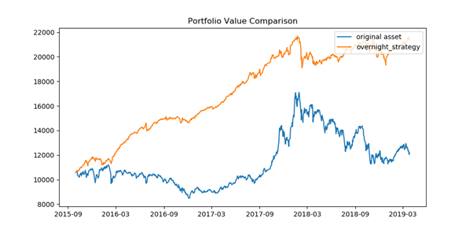

# kosdaq_overnight

주식 매매전략 중 Overnight 매매전략을 자동으로 수행하는 시스템를 구축하는 프로젝트입니다. AWS, CreonPlus API, Python을 사용합니다.

For people who prefer reading in english, please use the link below to see my comprehensive report!

[Link to Report](docs/KOSDAQ_Overnight_ProjectReport.pdf)

## 1. Overnight 전략이란?

규칙적으로 장 마감시점에 특정 주식을 매입하고, 저녁과 밤 동안 주식을 보유하다가 다음날 장 개장시점에 매도하는 전략입니다. 주식을 밤 동안에만 보유하고 있기 때문에 Overnight 전략이라고 부릅니다.

이런걸로 돈을 벌 수 있다고? 라는 생각이 드실텐데, 과거 기간 데이터에 테스트 시에는 수익률이 좋은 전략입니다.

<KODEX 코스닥 150 ETF>

- 기간: 2015.09월 - 2019.03월
- 누적 수익률: 103.19%
- 연간 수익률: 22.56%
- 파란색 그래프: ETF의 시세
- 주황색 그래프: Overnight 전략 포트폴리오 가치

믿기지 않으신다면 아래 링크를 참조해서 어떻게 테스트를 했는지 살펴보세요. 지금도 먹히는 전략일지는 개개인의 판단에 맡깁니다. (저한테 와서 돈 물어달라고 하지 마세요!)

[자세한 내용 보러가기](docs/strategy.md)

## 2. 자동 트레이딩 시스템 구현

전략이 유효하다면 한번 직접 실행해봐야겠죠! 하지만 직접 매일 개장시간과 폐장시간에 증권사 MTS(Mobile Trading System)에 접속해서 주문을 거실 건가요? 진정한 자본가라면 손하나 까딱하지 않아도 수익이 나오는 꿈을 꾸며 자동 매매 시스템을 구축해야 합니다.

매매 시스템은 이렇게 구성되어 있습니다.
- AWS(Amazon Web Service)를 이용해서 가상 컴퓨터를 구동
- 대신증권 HTS 및 Creon API를 가상 컴퓨터에 설치
- Python을 이용하여 로그인, 매수, 매도를 자동화
- Microsoft 작업 스케쥴러를 이용해서 작업신호 보내기
- ????
- PROFIT!

Creon API를 호출하는데 사용한 Python 코드는 이 Github에 공개되어 있습니다.

[Module Documentation](docs/modules.md)

AWS에서 가상 컴퓨터를 세팅한 방법이 궁금하다면?

[AWS로 매매 시스템 구축하기](docs/implementation.md)

## 3. [Behind Story & 후기](docs/story.md)

