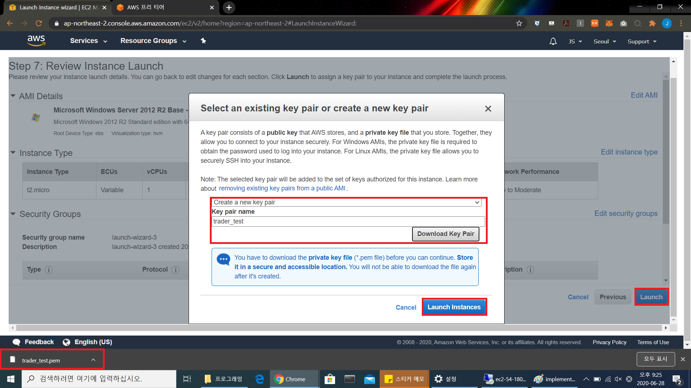

# AWS로 매매 시스템 구축하기

## 1. AWS 인스턴스 생성하기
EC2 t2.micro Windows Server 2012 R2

AWS에 로그인하여 EC2 서비스에서 Launch Instance를 시작합니다. Windows 2012 R2를 검색해서 기본 가상머신 이미지로 선택합니다.

과금 없이 Free tier로 이용할 수 있는 최소 스펙의 인스턴스인 t2.micro를 선택합니다. 이후에 직접 접속해보시면 버벅임을 통해 최소 스펙(...) 이라는 사실을 절실히 느낄 수 있습니다. 하지만 우리는 고성능 컴퓨팅 파워가 필요한 것이 아니기 때문에 괜찮습니다.

가상머신 접속을 위한 개인키를 생성하고 다운로드 받습니다.

가상머신 인스턴스가 생성되고 초기화 중인 것을 확인할 수 있습니다.

가상머신 접속을 위한 데스크탑 접속 파일(.rdp)와 패스워드를 가져올 차례입니다. 우선 Download Remote Desktop File 버튼을 클릭하여 접속용 파일을 다운로드합니다. 이후에 패스워드를 가져오기 위해 Get Password 버튼을 클릭합니다.

패스워드는 저번 단계에서 생성한 개인키(.pem) 파일을 입력하고 Decrypt Password 버튼을 클릭해서 알아낼 수 있습니다.

알아낸 패스워드를 클립보드에 복사합니다. 옆의 문서가 겹친 아이콘을 클릭하면 자동으로 복사를 수행합니다.

다운받은 .rdp 파일을 실행하고, 복사한 비밀번호를 입력합니다.

자동 매매를 위한 가상 머신이 생성된 것을 확인할 수 있습니다.

## 2. 가상 머신 세팅 및 필수 프로그램 설치하기

처음 설치된 Windows 서버에서는 한국어 설정이 되어있지 않습니다. 한국어 기반의 HTS를 사용하기 위해서 한국어를 제어판에서 추가해야 합니다. 제어판의 Clock, Language, and Region 에서 Add Language를 클릭해주세요.

스크롤을 쭉 내리시다가 보면 친숙한 한국어를 찾을 수 있습니다. 한국어가 기입된 네모박스를 선택하고 우측 하단의 Add 버튼을 눌러주세요.

한국어가 언어에 추가된 것을 확인하실 수 있습니다. Move up 버튼을 이용해서 최상위로 옮겨주시면 더 좋습니다. Options 버튼을 선택해서 한국어 세팅을 마저 해보도록 합시다.

Download and install language pack 버튼을 클릭해서 언어 팩을 다운로드 및 설치해주세요. 시간이 좀 소요되므로 인내심을 가지고 기다려주시기 바랍니다.

Language pack 설치가 완료되었습니다.

다 끝난줄 아셨나요? 마지막으로 시계, 언어 및 국가별 옵션으로 들어가서 국가 또는 지역을 클릭해주시기 바랍니다. 개발자로서 비영어권에 태어나면 늘상 겪어야 하는 일입니다.

팝업창에서 관리자 옵션 탭을 선택하신 후, 시스탬 로캘 변경에서 한국어(대한민국)으로 국가를 설정해주시기 바랍니다. 이러면 유니코드 미지원 프로그램에서도 한국어가 제대로 디스플레이 됩니다. 이로서 한국어 세팅이 완료되었습니다.

서버 윈도우는 보안 정책 상 기본적으로 Internet Explorer 인터넷 브라우저 접속이 막혀있기 때문에 설정을 변경해주어야 합니다. 작업표시줄 좌 하단의 서버 관리자(Server Manager) 버튼을 클릭해서 서버 관리자를 띄워주시기 바랍니다. 좌측의 Local Server를 선택한 후 IE Enhanced Security Configuration 옆의 On 을 클릭해주세요.

모두 사용 안 함으로 설정해주신 후 확인을 눌러주세요. 언어가 현재 한국어로 전환된 것을 확인하실 수 있는데, 제가 중간에 윈도우를 한번 다시 시작하여 전 단계에서 수행한 한국어 세팅들이 적용되었기 때문입니다.

IE 보안세팅을 완료한 후, 바탕화면의 EC2 Microsoft 아이콘을 클릭해서 Internet Explorer를 실행시켜주시기 바랍니다.

검색을 통해 Creon 홈페이지로 이동한 후, 다운로드 센터에서 Creon HTS를 다운받아주세요. Creon API를 사용하기 위한 Creon Plus는 Creon HTS 내부에 내장되어 있습니다.

Creon HTS 까지 설치가 완료되었습니다.

## 3. Python 코드 이동 및 변수세팅

윈도우 세팅을 마쳤으니 이제는 자동매매를 실행할 준비를 해야 합니다. 현재 보고계신 Github의 메인 창으로 이동해서 소스코드를 다운받아 주세요. Git을 사용하길 원하실 경우 적당한 폴더에서 Clone을 하셔도 됩니다.

파이썬 기반 소스코드이기 때문에 실행을 위해 Python 또한 다운받아서 설치해 줍니다.

바탕화면 오른쪽 하단의 시계를 우클릭하여 날짜 및 시간 설정으로 들어가주시기 바랍니다. 저희가 설정할 매매 시간은 한국시간(UTC +9) 기준이기 때문에, 표준 시간대를 서울 기준으로 변경해줍니다.  

소스 코드 중 자동로그인을 담당하는 login_test 모듈을 편집하여 사용할 Creon 계정의 ID, Password, 공인인증서 비밀번호를 설정해 줍니다. 파이썬을 통해 이 정보를 매일 자동으로 기입하여 HTS에 로그인하게 됩니다. 개인정보가 유출되지 않도록 조심해주시기 바랍니다.

소스코드가 사용하고 있는 패키지들을 설치해주어야 합니다. Cmd(커맨트 프롬프트 ) 창을 켜서 다운로드한 소스코드의 압축을 푼 위치로 이동합니다. 이동 후에는 해당 디렉토리에서

~~~
pip install -r requirements.txt
~~~

위 명령어를 사용해서 필요한 패키지들을 설치해 줍니다.

크레온 HTS를 실행시켜서 로그인을 테스트 해봅시다. 공인인증서가 없다고 나오는 군요. 가상 머신 상으로 공인인증서를 발급하거나, 이미 발급한 공인인증서의 복사본을 옮겨주어야 가상 머신에서 매매를 할 수 있습니다.  

이미 보유한 공인인증서가 있다고 가정하고 보안센터를 통해 "내보내기" 기능을 통해서 공인인증서 파일을 복제한후 가상머신으로 옮겨주었습니다. 인증서 가져오기를 클릭해서 공인인증서를 HTS 상에 인식시켜 줍니다.

가상머신 접속을 통해 원격으로 전송하는 키보드 입력은 HTS의 키보드 보안에 걸려서 제대로 ID, PW 입력이 이루어지지 않습니다. HTS 로그인 창의 우하단에 위치한 설정 버튼을 눌러서 키보드 보안프로그램 사용과 기타 자동실행에 차질을 주는 메모리 보안 프로그램을 사용 해제해주도록 합니다.

위 단계가 마무리 된 후 login_test.py 파일을 실행시켜보면 자동 로그인이 수행되는 것을 확인하실 수 있습니다.

## 4. Windows 작업 스케쥴러에 작업 예약하기

매일 동일한 시간에 자동매매 코드를 실행하기 위해서 저희는 윈도우 서버에 내장된 작업 스케쥴러를 이용할 것입니다. 시작버튼을 눌러서 검색창에서 작업 스케쥴러를 찾아서 실행시켜 주세요.

Overnight 전략 중 장 마감 전 매수를 실행하는 코드를 등록해보도록 하겠습니다. 작업 만들기를 클릭해서 새 작업 만들기 창을 띄운 후 일반 탭에서 적당한 작업 이름을 지정하고, 가장 높은 권한을 부여해줍니다.

트리거 탭으로 이동한 후, 매일 지정된 시간에 실행 트리거를 세팅해줍니다. 이제 이 트리거 조건이 만족될 때마다 윈도우는 자동으로 등록된 프로그램을 실행할 것입니다. 장 마감 10분 전 시장가 매도를 넣을 경우 종가로 매수주문 체결이 되기 때문에, 오후 3시 20분으로 시간 트리거를 설정해줍니다.

트리거 탭에서 시간 트리거가 생성된 것을 확인하실 수 있습니다.

동작 탭으로 이동해서 트리거가 발동되면 실행할 파이썬 코드를 등록해 줍니다. 동작을 프로그램 시작으로 세팅한 후, 프로그램/스크립트 창에 찾아보기를 통해 다운받은 소스코드 중 buy_3pm.py 파일을 등록해 줍니다.

동작 탭에서 소스코드가 실행 등록이 된 것을 확인할 수 있습니다.

같은 방법으로 오전 9시 20분에 sell_9am.py 파일을 등록해주어 장 개장 이후 매도를 할 수 있도록 해줍니다. 오후 5시에는 장 마감 이후 당일의 거래와 포트폴리오 가치를 기록할 수 있도록 log_5pm.py 파일을 등록해줍니다. 작업 스케쥴러 라이브러리 화면에서 모든 코드가 등록된 것을 확인할 수 있습니다.

각 작업의 실행 테스트가 필요한 경우 특정 작업을 선택하고 우측의 실행 버튼을 클릭하면 트리거와 무관하게 예약된 작업을 실행하여 테스트 해 볼 수 있습니다. 꼭 개장전, 마감전이 아니더라도 개장시간 중에 실행버튼을 통해 매수, 매도가 정상적으로 이루어지는지 확인해보시기 바랍니다.
