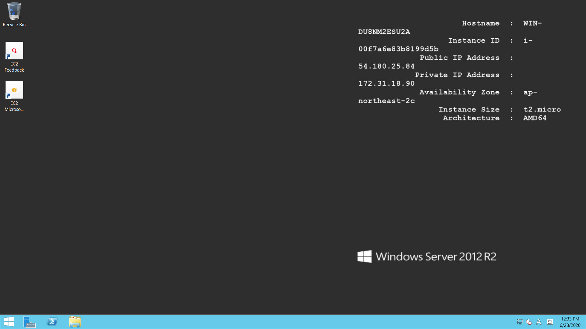

# AWS로 매매 시스템 구축하기

## 1. AWS 인스턴스 생성하기
EC2 t2.micro Windows Server 2012 R2

AWS에 로그인하여 EC2 서비스에서 Launch Instance를 시작합니다. Windows 2012 R2를 검색해서 기본 가상머신 이미지로 선택합니다.

과금 없이 Free tier로 이용할 수 있는 최소 스펙의 인스턴스인 t2.micro를 선택합니다. 이후에 직접 접속해보시면 버벅임을 통해 최소 스펙(...) 이라는 사실을 절실히 느낄 수 있습니다. 하지만 우리는 고성능 컴퓨팅 파워가 필요한 것이 아니기 때문에 괜찮습니다.

가상머신 접속을 위한 개인키를 생성하고 다운로드 받습니다.

가상머신 인스턴스가 생성되고 초기화 중인 것을 확인할 수 있습니다.

가상머신 접속을 위한 데스크탑 접속 파일(.rdp)와 패스워드를 가져올 차례입니다. 우선 Download Remote Desktop File 버튼을 클릭하여 접속용 파일을 다운로드합니다. 이후에 패스워드를 가져오기 위해 Get Password 버튼을 클릭합니다.

패스워드는 저번 단계에서 생성한 개인키(.pem) 파일을 입력하고 Decrypt Password 버튼을 클릭해서 알아낼 수 있습니다.

알아낸 패스워드를 클립보드에 복사합니다. 옆의 문서가 겹친 아이콘을 클릭하면 자동으로 복사를 수행합니다.

다운받은 .rdp 파일을 실행하고, 복사한 비밀번호를 입력합니다.

자동 매매를 위한 가상 머신이 생성된 것을 확인할 수 있습니다.

## 2. 가상 머신에 필수 프로그램 설치하기
CreonPlus + 호환성 및 보안설정

기타 호환용 프로그램

## 3. Python 코드 이동 및 변수세팅
이메일을 통해 파이썬 코드, 공인인증서 옮기기

로그인 값(ID, PW, cert) 세팅하기

매매종목 세팅하기

## 4. Windows 작업 스케쥴러에 작업 예약하기
매일 시간 기반으로 Trigger 설정하기

Run 눌러서 실행 테스트
