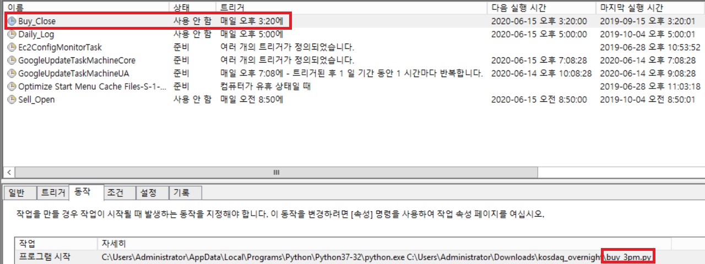
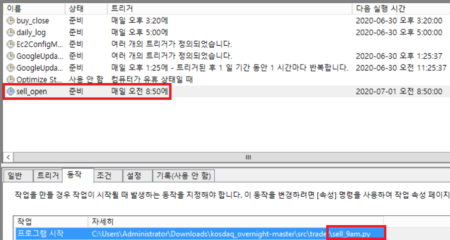

# Module Documentation

### Writer: 신준수

## buy_3pm.py

### 설명

장 마감 전 오후 3시 매수주문 수행 모듈
- 개장일 체크 수행
- 자동로그인 모듈 호출 -> 로그인 수행
- 현재 잔고로 지정된 종목 최대수량 시장가 매수주문
- 자동로그인 모듈 호출 -> 로그아웃 수행

### 사용법

Windows 작업스케쥴러에 장 마감 직전 시간을 실행 트리거로 설정 후 등록하여 사용

## buy_close.py

### 1. function -  buy_available_amount
- Input: none
- Output: none
- Actions:
  - Creon API 연결여부 체크
  - Creon API 주문 초기화
  - 주문가능수량 체크
  - 지정된 종목에 대해 시장가 매수주문

~~~
buy_available_amount()
~~~

### 2. Class B
#### 1-1. function a
#### 1-2. function b

## check_mkt_open.py

## log_5pm.py

## logger.py

## login_test.py

## sell_9am.py

장 개장 전 오전 8시 50분 매도주문 수행 모듈
- 개장일 체크 수행
- 자동로그인 모듈 호출 -> 로그인 수행
- 현재 보유수량 전량 시장가 매도주문
- 자동로그인 모듈 호출 -> 로그아웃 수행

## sell_open.py
