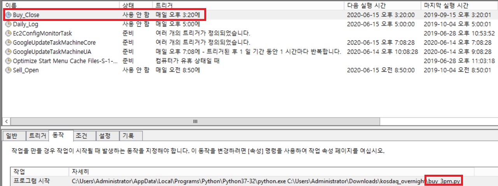
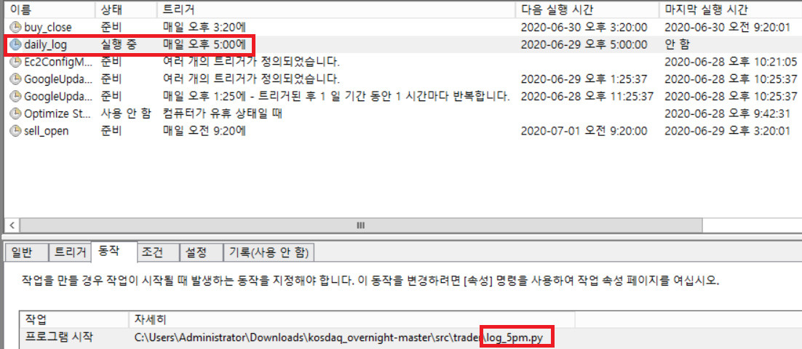
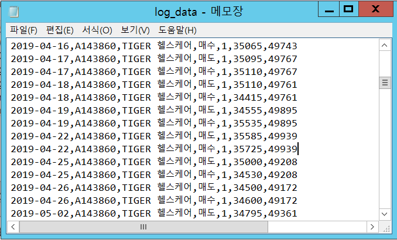

# Module Documentation

### Writer: 신준수

## buy_3pm.py

### 설명

장 마감 전 오후 3시 매수주문 수행 모듈
- 개장일 체크 수행
- 자동로그인 모듈 호출 -> 로그인 수행
- 현재 잔고로 지정된 종목 최대수량 시장가 매수주문
- 자동로그인 모듈 호출 -> 로그아웃 수행

### 사용법

Windows 작업스케쥴러에 장 마감 직전 시간을 실행 트리거로 설정 후 등록하여 사용

## buy_close.py

### 1. function -  buy_available_amount():
- Input: none
- Output: none
- Actions:
  - Creon API 연결여부 체크
  - Creon API 주문 초기화
  - 주문가능수량 체크
  - 지정된 종목에 대해 시장가 매수주문

~~~
>>> buy_available_amount()
~~~

## check_mkt_open.py

### 1. function -  check_if_open(date):
- Input: date - String in "yyyyMMdd" format
- Output: 0 or 1
- Actions:
  - 주식시장 개장일 X: return 0 (주말, 공휴일)
  - 주식시장 개장일 O: return 1

~~~
>>> check_if_open(20200101)
0

>>> check_if_open(20200103)
1
~~~

### 2. function -  check_today_open():
- Input: none
- Output: 0 or 1
- Actions:
  - 실행시점의 날짜가 주식시장 개장일인지 체크
  - 주식시장 개장일 X: return 0
  - 주식시장 개장일 O: return 1

~~~
>>> check_today_open()
1
~~~

## log_5pm.py

### 설명

장 마감 이후 오후 5시 당일 매매일지 기록
- 개장일 체크 수행
- 당일 매매기록 조회
- 당일 포트폴리오 가치 조회
- path 변수에 기록된 CSV 파일에 일별 매매기록, 포트폴리오 가치 기록

### 사용법

Windows 작업스케쥴러에 장 마감 직전 시간을 실행 트리거로 설정 후 등록하여 사용

### 결과물

Path에 지정된 CSV 파일에 일일 매매내역이 기록됩니다.

## logger.py

### 1. function -  get_trade_log_today():
- Input: none
- Output: list
- Actions:
  - 로그인된 Creon 계정에서 당일 거래한 기록을 가져와 return 한다
  - list의 row에 포함된 정보:
    - 일자, 종목코드, 종목이름, 매수/매도 여부, 거래수량, 거래가격

~~~
>>> get_trade_log_today()
[['2019-08-30', 'A143860', 'TIGER 헬스케어', '매도', 1, 24700, 43455], ['2019-08-30', 'A143860', 'TIGER 헬스케어', '매수', 1, 24500, 43455]]
~~~

### 2. function -  get_portfolio_value():
- Input: none
- Output: int
- Actions:
  - 로그인된 Creon 계정의 잔고 평가액(보유종목 + 예수금)을 return 한다

~~~
>>> get_portfolio_value()
43455
~~~

### 3. function -  write_log(data, file_path):
- Input:
  - data - [date, asset_code, asset_name, buy/sell, traded_volume, traded_price, portfolio_value]
  - file_path - String
- Output: none
- Actions:
  - 주어진 path에 존재하는 csv 파일의 뒤쪽에 주어진 data를 새로운 행으로 추가하여 입력한다  

~~~
>>> write_log()
~~~

## login_test.py

### 1. function -  login(name, pw, cert):
- Input:
  - name - Creon ID
  - pw - Creon PW
  - cert - 공인인증서 비밀번호
- Output: Application
- Actions:
  - 주어진 id, pw, cert로 자동로그인을 수행한다
  - pywinauto로 실행시킨 프로그램 객체 Application을 반환한다

~~~
>>> login(testname, testpw, testcert)
<pywinauto.application.Aplication object at 0x039100A0>
~~~

### 2. function -  logout():
- Input: none
- Output: none
- Actions:
  - 로그인된 Creon 계정을 로그아웃하고 Application을 종료한다

~~~
>>> logout()
~~~

## sell_9am.py

### 설명

장 개장 직후 오전 8시 50분 매도주문 수행 모듈
- 개장일 체크 수행
- 자동로그인 모듈 호출 -> 로그인 수행
- 현재 보유 종목 최대수량 시장가 매도주문
- 자동로그인 모듈 호출 -> 로그아웃 수행

### 사용법

Windows 작업스케쥴러에 장 개장 직전 시간을 실행 트리거로 설정 후 등록하여 사용

## sell_open.py

### 1. function -  sell_available_amount():
- Input: none
- Output: none
- Actions:
  - Creon API 연결여부 체크
  - Creon API 주문 초기화
  - 매도가능수량 체크
  - 지정된 종목에 대해 시장가 매도주문

~~~
>>> sell_available_amount()
~~~
