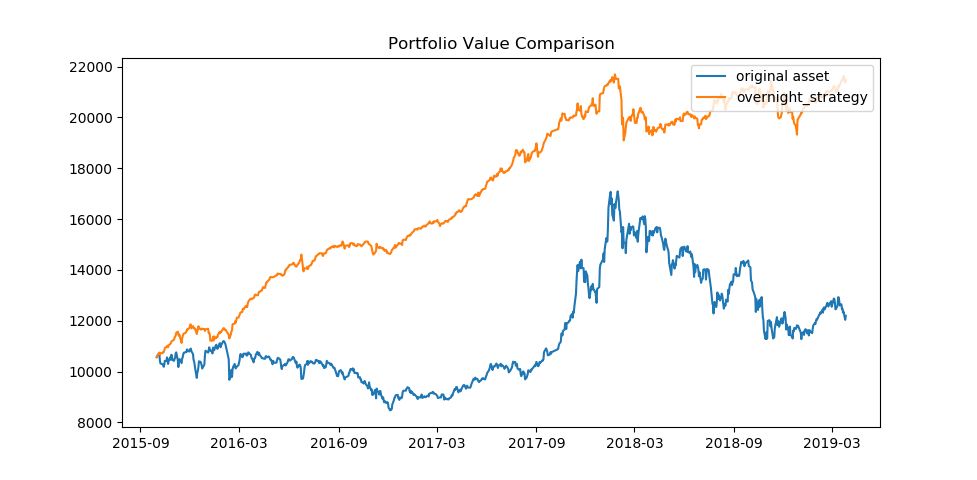
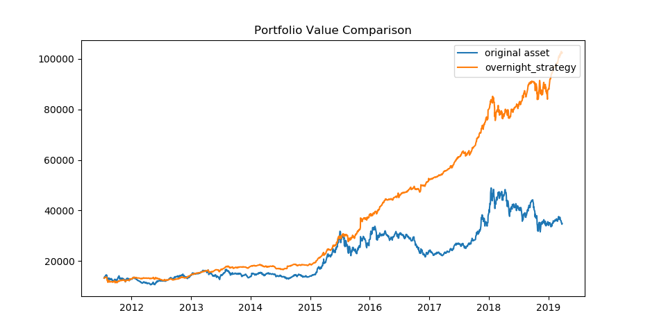

# Overnight 전략 소개

## 1. 전략 개요 및 관련논문 소개

전략 자체는 매일 장 마감 직전 특정 종목을 매입, 장 개장 직후 특정 종목을 매도하는 패턴입니다. 전략의 이론적인 기반은 아래 논문에서 가져왔습니다.

[Overnight returns and firm-specific investor sentiment](https://www.cambridge.org/core/journals/journal-of-financial-and-quantitative-analysis/article/overnight-returns-and-firmspecific-investor-sentiment/20DD2F7ABA4BBEB2C2327DDD51E10559)

위 논문에서는 Overnight Return(위 매매전략에 따른 수익률)이 특정 종목이 투자심리(investor sentiment)에 영향을 받는 정도의 지표로 사용될 수 있다고 이야기하고 있습니다. 이를 이용하면 반대로, 실제로 종목이 영업실적과 같은 구체적인 지표보다 투자심리에 영향이 받는 종목이라면 Overnight 전략에서 수익률을 기대해볼수 있다는 말이 될 수 있습니다.

논문에서는 왜 이런 현상이 발생하는지 까지 확답을 주고 있지는 않지만, 보통 개인 투자자가 투자심리에 더 영향을 많이 받으며 이들이 보통 정보를 얻고 투자를 결심하고 주문을 넣는 시간이 장 마감 이후라서가 아닐까라고 언급하고 있습니다.

예를 들어, 직장인 개인 투자자 foo가 있다고 생각해 봅시다. foo는 장 중인 09:00 ~ 15:30에는 출근과 회사일에 바쁘기 때문에 새로운 뉴스에 신경쓸 시간이 없습니다. foo는 바쁜 하루를 마치고 퇴근하는 길에 하나의 뉴스를 봅니다.

"[특보]hello world 제약 코로나 바이러스 치료제 임상 준비중으로 알려져..."

안그래도 직장 동료들이 코스피가 1400에 갔을때 삼성전자를 사서 한몫을 건진 것이 부러웠던 foo는 이렇게 생각합니다. "이건 내 일생일대의 기회야!! 이거 안사면 정말 손해보는거다...". 다급한 foo는 hello world 제약이 얼마인지는 별로 고려하지 않습니다. 일단 남들보다 빨리 hello world 제약을 사는 것이 중요합니다. 묵혀두었던 주식계좌를 찾아서 돈을 송금하지만, 장이 마감되어서 foo는 hello world 제약을 당장 살 수가 없습니다. 그렇다면 foo는 언제 이 주식을 살까요? 아마 오늘 예약매수를 걸거나, 내일 아침에 장이 열리자마자 시장가 매수를 광클할 가능성이 높겠죠?

물론 모든 개인투자자들이 foo와 같이 행동하는 것은 아닙니다. 하지만 일부 개인투자자들은 투자심리에 영향을 많이 받기 때문에, 위와 같은 투자자들이 개장시간에 몰릴 경우 수요가 급증하여 장 초반에 가격이 적정 이상으로 올라갈 수 있습니다. 그 이후로 장중에는 좀 더 침착한 투자자들이 나타나서, 나름 계산기를 두드려보고 매수와 매도를 해서 hello world 제약은 좀 더 합리적인 가격을 찾아 가겠지요.

위와 같은 시나리오가 실제로 일어나는지 보다는, 결국 위와 같은 현상이 있다면 이용해서 지속적인 수익률을 얻는 것이 중요하겠죠. 이 아이디어에 착안해서 기업의 가치평가가 상대적으로 어렵고, 투자심리에 영향을 받는 투자자들이 많은 종목을 찾아서 Overnight 전략의 유효성을 과거 데이터로 확인하고 실제로 수행하는 것이 전략의 근간입니다.

## 2. 과거 데이터 테스트 결과 소개

위 논문과 이론에 착안해서 개인적으로 개인 투자자의 참여가 상대적으로 활발한 코스닥 시장과 기업가치 산정이 상대적으로 어려운 헬스케어(바이오) 섹터에 대해서 Overnight Return 이 관측될 것이라는 예상을 하고 해당 종목의 지수 ETF에 대해서 과거 데이터로 백테스팅을 해보았습니다.

<KODEX 코스닥 150 ETF>

<TIGER 헬스케어 ETF>

파란색 그래프가 기초자산(원본 ETF)의 가격 추이, 오렌지색 그래프가 Overnight 전략을 사용한 것을 가정했을 때의 포트폴리오 가치입니다. 기초자산은 최초 시점부터 구매 후 보유, Overnight 전략은 매일 가진 돈의 전부를 매수하고 가진 주식 전부를 매도한다고 가정한 결과입니다.

최초에 1주로 시작했다면 이익을 남겨도 바로 2주를 사지는 못하겠지만, 어느정도 운용 규모가 될 경우 무시할 수 있기에 1.05주와 같이 쪼개서 전액 매수할 수 있다고 가정하였씁니다.

물론 위 그래프는 거래에 수반되는 증권사 수수료, 증권거래세, 유관기관비용 등은 감안하지 않은 결과입니다. 실제로는 거래일마다 매수, 매도를 반복하기 때문에 거래비용이 발생하며, 시장에 거래량이 부족하면 매수와 매도하는 행위 자체가 가격에 영향(다른말로 slippage)을 줄 수 있어 수익률이 더 낮아질 수 있습니다.

어때요, 흥미롭지 않으신가요? 다른 종목에도 직접 테스트를 해보고 싶다면 src/backtest 디렉토리의 모듈들을 참고하시기 바랍니다. 테스트에 사용할 데이터는 증권사 API를 이용하여 가져올 수 있으며, 그래프는 간단한 계산과 matplotlib을 사용하여 그려보실 수 있습니다.
